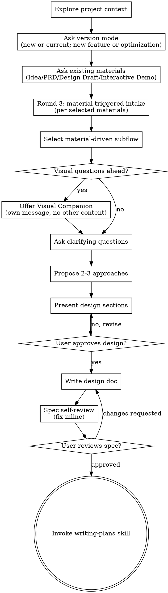

# Brainstorming Ideas Into Designs

Help turn ideas into fully formed designs and specs through natural collaborative dialogue.

Start by understanding the current project context, then ask questions one at a time to refine the idea.

This skill has two mandatory gates:

- **design-gate:** product/design alignment and user-value closure, ending in approved `Vx.y.z-design.md`
- **spec-gate:** implementation-ready spec closure (testable boundaries, capacity and material traceability), ending in approved `Vx.y.z-spec.md`

<HARD-GATE>
Do NOT invoke any implementation skill, write any code, scaffold any project, or take any implementation action until you have presented a design and the user has approved it. This applies to EVERY project regardless of perceived simplicity.
</HARD-GATE>

## Anti-Pattern: "This Is Too Simple To Need A Design"

Every project goes through this process. A todo list, a single-function utility, a config change — all of them. "Simple" projects are where unexamined assumptions cause the most wasted work. The design can be short (a few sentences for truly simple projects), but you MUST present it and get approval.

## Checklist

You MUST create a task for each of these items and complete them in order:

1. **Explore project context** — check files, docs, recent commits
2. **Ask version mode (mandatory)** — ask whether this is `Start New Version` or `Continue Current Version`; if new, ask whether it is `New Feature` or `Small Optimization`
3. **Ask existing materials (mandatory, multi-select)** — ask exactly what exists now: `Idea | PRD | Design Draft | Interactive Demo`
4. **Round 3 — Material-triggered intake (mandatory when applicable)** — for **each** material selected in Step 3, run the matching branch in **Material-triggered intake** below; multi-select means run **all** applicable branches before **deep** clarifying questions. Lightweight dialogue **during** intake is allowed and expected (see **Material-triggered intake**). `Idea` alone adds no file/MCP intake. `None of the above` skips intake and runs bootstrap questions only (see that branch).
5. **Material-driven flow selection** — choose emphasis for upcoming clarifying questions from merged intake context and version mode (see Material-Driven Subflows below)
6. **Offer visual companion** (optional, recommended when it reduces visual ambiguity) — this is its own message, not combined with a clarifying question. See the Visual Companion section below.
7. **Ask clarifying questions** — one at a time, understand purpose/constraints/success criteria
8. **Propose 2-3 approaches** — with trade-offs and your recommendation
9. **design-gate: Present design** — in sections scaled to their complexity, get user approval after each section
10. **Confirm version root** — lock `Vx.y.z-<topic>` naming with user
11. **Challenge version capacity** — explicitly question whether this version scope is too large; if yes, split into multiple PR/version tracks before writing docs
12. **Write gate docs** — create/update `docs/Vx.y.z-<topic>/Vx.y.z-design.md` first, then `docs/Vx.y.z-<topic>/Vx.y.z-spec.md`
13. **Initialize governance docs** — create/update `docs/Vx.y.z-<topic>/Vx.y.z-changelog.md` and `docs/Vx.y.z-<topic>/Vx.y.z-decisions.md`
14. **spec-gate self-review** — quick inline check for placeholders, contradictions, ambiguity, scope (see below)
15. **Spec precheck output (mandatory)** — before writing-plans, ensure spec contains minimum code reconnaissance: affected paths, immutable constraints, and Figma diff notes
16. **Superpowers pipeline (hooks) (mandatory)** — ask the user whether this version runs the **full extension / lab acceptance pipeline** (ordered `autotest → mocktest → devicetest`, manifest/build alignment checks at Stop). Explain that **No** skips those hooks only; PR docs, version test template quality, spec confirm, evolution, and **Figma Live Design Sync** (when the plan includes it) stay as today. Append to `Vx.y.z-spec.md` an exact H2 `## Superpowers pipeline (hooks)` and one line: `Full extension acceptance pipeline: Yes` or `Full extension acceptance pipeline: No` (or Chinese: `完整扩展验收流程：是` / `完整扩展验收流程：否`). `hooks/spec-gate-precheck` requires this before `/writing-plans`.
17. **User reviews written spec** — ask user to review the spec file before proceeding
18. **Transition to implementation** — invoke writing-plans skill to create implementation plan

## Process Flow



**The terminal state is invoking writing-plans.** Do NOT invoke frontend-design, mcp-builder, or any other implementation skill. The ONLY skill you invoke after brainstorming is writing-plans.

## The Process

**Understanding the idea:**

- Check out the current project state first (files, docs, recent commits)
- Ask version mode before deep questions:
  - `Start New Version` or `Continue Current Version`
  - If `Start New Version`: `New Feature` or `Small Optimization`
- Ask existing materials as mandatory multi-select:
  - `Idea | PRD | Design Draft | Interactive Demo`
- **Round 3 (material-triggered intake):** When Step 3 includes `PRD`, `Design Draft`, and/or `Interactive Demo`, run **every** matching intake branch (see **Material-triggered intake**) before **deep** clarifying questions. **One intake prompt per message** (location / link questions count as intake). Normal **lightweight** conversation during intake (paths, confirmations, brief context) is fine — you are only deferring the **main** refinement pass until materials are loaded. `Idea` alone skips file/MCP intake and goes straight to collaborative refinement.
- Before asking detailed questions, assess scope: if the request describes multiple independent subsystems (e.g., "build a platform with chat, file storage, billing, and analytics"), flag this immediately. Don't spend questions refining details of a project that needs to be decomposed first.
- If the project is too large for a single spec, help the user decompose into sub-projects: what are the independent pieces, how do they relate, what order should they be built? Then brainstorm the first sub-project through the normal design flow. Each sub-project gets its own spec → plan → implementation cycle.
- For appropriately-scoped projects, ask questions one at a time to refine the idea
- Prefer multiple choice questions when possible, but open-ended is fine too
- Only one question per message - if a topic needs more exploration, break it into multiple questions
- Focus on understanding: purpose, constraints, success criteria

## Opening Question Templates (Use As-Is)

Use these exact question blocks for Step 2 and Step 3. Do not skip them.

Step 2 — Version mode (mandatory):

> Before we continue, choose version mode:
> 1) Start New Version
> 2) Continue Current Version
>
> If you choose **Start New Version**, also choose:
> A) New Feature
> B) Small Optimization

Step 3 — Existing materials (mandatory, multi-select):

> What materials do you already have? (multi-select)
> - Idea
> - PRD
> - Design Draft
> - Interactive Demo
> - None of the above

If "None of the above" is selected, run the 3-5 critical bootstrap questions before proposing any approaches.

Step 4 — Round 3 preamble (use **once** right after Step 3 when **any** of `PRD`, `Design Draft`, or `Interactive Demo` is selected):

> Next I’ll **load what you already have** before we go deeper.  
> For each material you picked, I’ll ask **one** question at a time for where it lives, then I’ll read or inspect it.  
> If your team routes locations through a product owner, pull them in or relay their answer here.

Skip this preamble when **only** `Idea` is selected (no PRD / Design Draft / Interactive Demo) — go straight to clarifying questions.

Checklist step 16 — Superpowers pipeline / hooks (mandatory, before user spec review):

> Does this version run the **full extension + lab acceptance pipeline** (ordered `autotest → mocktest → devicetest`, plus manifest/build checks at Stop)?
> - **Y** — Yes → hooks enforce the normal extension gates.
> - **N** — No → hooks skip extension test order, manifest report at Stop, and package-vs-manifest drift only; PR docs, version test template, spec confirm, evolution, and **Figma Live Design Sync** (when the plan includes it) are unchanged.
>
> After the user answers, append to `Vx.y.z-spec.md` (exact heading, one status line):
>
> ```markdown
> ## Superpowers pipeline (hooks)
>
> Full extension acceptance pipeline: Yes
> ```
>
> or `Full extension acceptance pipeline: No` (or `完整扩展验收流程：是` / `完整扩展验收流程：否`). Required before `/writing-plans` (`hooks/spec-gate-precheck`).

**Clarification quality checkpoints (minimum bar):**

- Pressure-test value reality: is this a real user problem or an unvalidated assumption?
- Ensure path closure: can the user flow be described from input to successful outcome with no missing link?
- Force MVP cut: if scope is cut by half, what must remain for the product to still be viable?
- Probe AI leverage: which manual steps can be turned into AI-assisted suggestions or automation?
- Challenge version capacity: does this scope exceed one version's delivery capacity (time/risk/dependency)? If yes, force split before design sign-off.

These checkpoints tighten requirement clarity. They do NOT replace the existing brainstorming flow or user approval gates.

## Material-triggered intake (Round 3)

Run this **immediately after** Step 3 whenever the user selected one or more concrete materials (`PRD`, `Design Draft`, `Interactive Demo`). **Multi-select means running every applicable branch** — finish one branch fully (ask → read/inspect → note gaps) before starting the next, using the order below.

**Multi-select and dialogue:** If your human partner selected several materials, **finish reading/inspecting all of them** (all branches) before the **main** clarifying dialogue — the pass where you pressure-test requirements, compare approaches, and challenge scope **as if** the artifacts are already on the table. That **does not** forbid conversation earlier: during intake you should still talk normally for **lightweight** needs — confirming what was selected, asking for links/paths, short clarifications, acknowledgments, and “which file is canonical?” **Defer** deep Socratic questions, 2–3 approach proposals, and design sections until after your **Material intake summary**.

**Branch order (fixed):** `Interactive Demo` → `Design Draft` → `PRD`.  
The `Idea` option does **not** add an intake branch; it only shapes clarifying questions (see Material-Driven Subflows).

After all branches complete, write a short **Material intake summary** for yourself (what you read, what is missing, contradictions) — then continue to Material-Driven Subflows emphasis and **deep** clarifying questions.

### 1) Idea only — start dialogue

**When:** `Idea` is selected **and** no `PRD` / `Design Draft` / `Interactive Demo` is selected (or the user confirms those don’t exist yet).

**Actions:** No file or MCP intake. **Start collaborative dialogue** — proceed to clarifying questions and the rest of the checklist.

### 2) PRD — locate → read → start dialogue

**When:** `PRD` is selected.

**Actions (in order, one user-facing question at a time):**

1. Ask where the PRD lives (repo path, doc URL, wiki link, or equivalent). If your human partner doesn’t know, they should ask whoever owns the spec (e.g. product owner).
2. Read the PRD and any **linked** documents; explore related code paths that the PRD names or clearly implies.
3. **Then** continue: either the next selected branch (if any) or clarifying questions (**start dialogue** for this track).

### 3) Design Draft — locate → Figma MCP (if available) → read related → start dialogue

**When:** `Design Draft` is selected.

**Actions:**

1. Ask where the design lives (Figma URL/file key, design folder in repo, exported assets, etc.).
2. If the user provides Figma links/keys: first use `figma-url-readiness` / `/figma-read` to parse the URL, verify Figma MCP server health, verify the current session exposes the required Figma tools, and produce a restart handoff if the session tool list is frozen. Only after readiness passes, inspect the relevant file/pages/frames **before** debating UI details. If Figma MCP is **not** available, fall back to screenshots, exports, or PDFs your partner provides.
3. Read associated product/docs and skim relevant code for feasibility constraints.
4. Continue to the next branch or clarifying questions.

See also `skills/brainstorming/visual-companion.md` (Figma vs browser mockups).

### 4) Interactive Demo — locate code & URL → Figma MCP for interaction frames (if applicable) → read related → start dialogue

**When:** `Interactive Demo` is selected.

**Actions:**

1. Ask where the **demo code** lives (branch, path, repo) and how to run it (**URL** or local start steps).
2. If interaction specs live in Figma (flows, hotspots, motion): use `figma-url-readiness` / `/figma-read` first, then use Figma MCP when available the same way as Design Draft; otherwise use recorded clips, prototypes, or written flow notes.
3. Read related docs/code; treat the demo as **evidence** — note gaps vs product goals.
4. Continue to the next branch or clarifying questions.

### None of the above

No intake branches. Run the 3–5 bootstrap questions already defined in Step 3; do **not** propose approaches until those are answered.

## Material-Driven Subflows

After Step 2 (version mode), Step 3 (existing materials), and **Round 3 intake** when applicable, choose emphasis with these rules:

- **Version mode selected**
  - If `Continue Current Version`, prioritize compatibility with existing version scope and unresolved risks.
  - If `Start New Version`, require explicit statement whether this is `New Feature` or `Small Optimization` and enforce matching scope depth.
  - For `Small Optimization`, reject hidden feature creep; keep changes tightly bounded.

- **Idea selected**
  - Prioritize problem-definition questions: user problem, failed current path, success metrics, scope-out.
  - Do not jump to UI details before purpose and boundaries are explicit.

- **PRD selected**
  - Prioritize PRD de-ambiguation: conflicting goals, undefined acceptance criteria, vague non-functional constraints.
  - Convert fuzzy PRD statements into testable criteria.

- **Design Draft selected**
  - Prioritize design feasibility and state coverage: happy path, empty/error/loading states, consistency across entry points.
  - Require explicit interaction rules for key transitions.

- **Interactive Demo selected**
  - Prioritize flow closure against real interaction: entry -> key action -> feedback -> exit/recovery.
  - Treat demo as evidence, not truth; challenge gaps between demo behavior and product goals.

- **No material selected**
  - Ask 3-5 critical questions first, then auto-select subflow:
    1. What concrete user problem are we solving now?
    2. What is the first success signal we should observe?
    3. Who is the first target user segment?
    4. What is explicitly out of scope for this version?
    5. What deadline/risk constraint defines version capacity?
  - Do NOT propose approaches until these are answered.

- **Multiple materials selected**
  - **Intake:** You already ran every applicable **Material-triggered intake** branch in fixed order; keep findings in your **Material intake summary**.
  - **Clarifying emphasis:** Merge by strongest constraint first: `Interactive Demo/Design Draft > PRD > Idea`.
  - Keep a short "material usage note" in the design context (what was used, what is missing).

If feedback-signal hook context is injected during brainstorming:

- Finish the current user request first
- Then dispatch `agents/evolution-keeper.md`
- Have it record a structured feedback entry in `.claude/feedback/`
- Update `FEEDBACK-INDEX.md` and increment `occurrences` if the topic already exists
- Have the keeper **append** matching 进化建议 / candidate lines to `docs/LESSONS.md` per `agents/evolution-keeper.md`
- Require it to return a structured result (`recorded|updated|no-op`, topic file, `occurrences` delta, next `confirm/skip` need)

**Exploring approaches:**

- Propose 2-3 different approaches with trade-offs
- Present options conversationally with your recommendation and reasoning
- Lead with your recommended option and explain why

**Presenting the design:**

- Once you believe you understand what you're building, present the design
- Scale each section to its complexity: a few sentences if straightforward, up to 200-300 words if nuanced
- Ask after each section whether it looks right so far
- Cover: architecture, components, data flow, error handling, testing
- Be ready to go back and clarify if something doesn't make sense

**Design for isolation and clarity:**

- Break the system into smaller units that each have one clear purpose, communicate through well-defined interfaces, and can be understood and tested independently
- For each unit, you should be able to answer: what does it do, how do you use it, and what does it depend on?
- Can someone understand what a unit does without reading its internals? Can you change the internals without breaking consumers? If not, the boundaries need work.
- Smaller, well-bounded units are also easier for you to work with - you reason better about code you can hold in context at once, and your edits are more reliable when files are focused. When a file grows large, that's often a signal that it's doing too much.

**Working in existing codebases:**

- Explore the current structure before proposing changes. Follow existing patterns.
- Where existing code has problems that affect the work (e.g., a file that's grown too large, unclear boundaries, tangled responsibilities), include targeted improvements as part of the design - the way a good developer improves code they're working in.
- Don't propose unrelated refactoring. Stay focused on what serves the current goal.

## After the Design

**Documentation:**

- Write the validated design/spec to `docs/Vx.y.z-<topic>/Vx.y.z-design.md` and `docs/Vx.y.z-<topic>/Vx.y.z-spec.md`
- Use version-root docs and keep both artifacts in sync:
  - `docs/Vx.y.z-<topic>/Vx.y.z-design.md`
  - `docs/Vx.y.z-<topic>/Vx.y.z-spec.md`
- Initialize version-governance docs before handoff:
  - `docs/Vx.y.z-<topic>/Vx.y.z-changelog.md`
  - `docs/Vx.y.z-<topic>/Vx.y.z-decisions.md`
- Changelog discipline (design phase): if design/spec gets materially corrected, append the correction rationale and impact to `docs/Vx.y.z-<topic>/Vx.y.z-changelog.md`
- Use elements-of-style:writing-clearly-and-concisely skill if available
- Commit version documents to git

**Spec Self-Review:**
After writing the spec document, look at it with fresh eyes:

1. **Placeholder scan:** Any "TBD", "TODO", incomplete sections, or vague requirements? Fix them.
2. **Internal consistency:** Do any sections contradict each other? Does the architecture match the feature descriptions?
3. **Scope check:** Is this focused enough for a single implementation plan, or does it need decomposition?
4. **Ambiguity check:** Could any requirement be interpreted two different ways? If so, pick one and make it explicit.

Fix any issues inline. No need to re-review — just fix and move on.

**User Review Gate:**
After the spec review loop passes, ask the user to review the written spec before proceeding:

> "Spec written and committed to `<path>`. Please review it and let me know if you want to make any changes before we start writing out the implementation plan."

Wait for the user's response. If they request changes, make them and re-run the spec review loop. Only proceed once the user approves.

**Spec Precheck Gate (hard requirement before writing-plans):**

Spec must include all of the following sections (or equivalent explicit headings):

- affected paths/files (`受影响路径` / `Affected Paths`)
- immutable constraints (`不可变约束` / `Invariants`)
- design delta against Figma (`Figma 差异` / `Figma Diff`)

If any is missing, keep spec in draft state and do not proceed to writing-plans.

**Implementation:**

- Invoke the writing-plans skill to create a detailed implementation plan
- Do NOT invoke any other skill. writing-plans is the next step.

## Key Principles

- **One question at a time** - Don't overwhelm with multiple questions
- **Multiple choice preferred** - Easier to answer than open-ended when possible
- **YAGNI ruthlessly** - Remove unnecessary features from all designs
- **Explore alternatives** - Always propose 2-3 approaches before settling
- **Incremental validation** - Present design, get approval before moving on
- **Be flexible** - Go back and clarify when something doesn't make sense

## Visual Companion

A browser-based companion for showing mockups, diagrams, and visual options during brainstorming. Available as a tool — not a mode. Accepting the companion means it's available for questions that benefit from visual treatment; it does NOT mean every question goes through the browser.

**Offering the companion:** Keep it available, not mandatory. Offer it when:

- user asks for visual options directly, or
- selected materials include `Design Draft` / `Interactive Demo`, or
- visual ambiguity remains after one text clarification round.

When you offer it, use this message once for consent:
> "Some of what we're working on might be easier to explain if I can show it to you in a web browser. I can put together mockups, diagrams, comparisons, and other visuals as we go. This feature is still new and can be token-intensive. Want to try it? (Requires opening a local URL)"

**This offer MUST be its own message.** Do not combine it with clarifying questions, context summaries, or any other content. The message should contain ONLY the offer above and nothing else. Wait for the user's response before continuing. If they decline, proceed with text-only brainstorming.

If they decline, do not repeat the same offer again for the same topic unless they explicitly ask for visual support later.

**Per-question decision:** Even after the user accepts, decide FOR EACH QUESTION whether to use the browser or the terminal. The test: **would the user understand this better by seeing it than reading it?**

- **Use the browser** for content that IS visual — mockups, wireframes, layout comparisons, architecture diagrams, side-by-side visual designs
- **Use the terminal** for content that is text — requirements questions, conceptual choices, tradeoff lists, A/B/C/D text options, scope decisions

A question about a UI topic is not automatically a visual question. "What does personality mean in this context?" is a conceptual question — use the terminal. "Which wizard layout works better?" is a visual question — use the browser.

If they agree to the companion, read the detailed guide before proceeding:
`skills/brainstorming/visual-companion.md`
