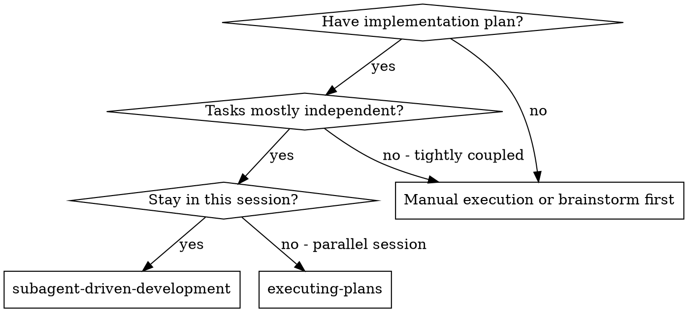
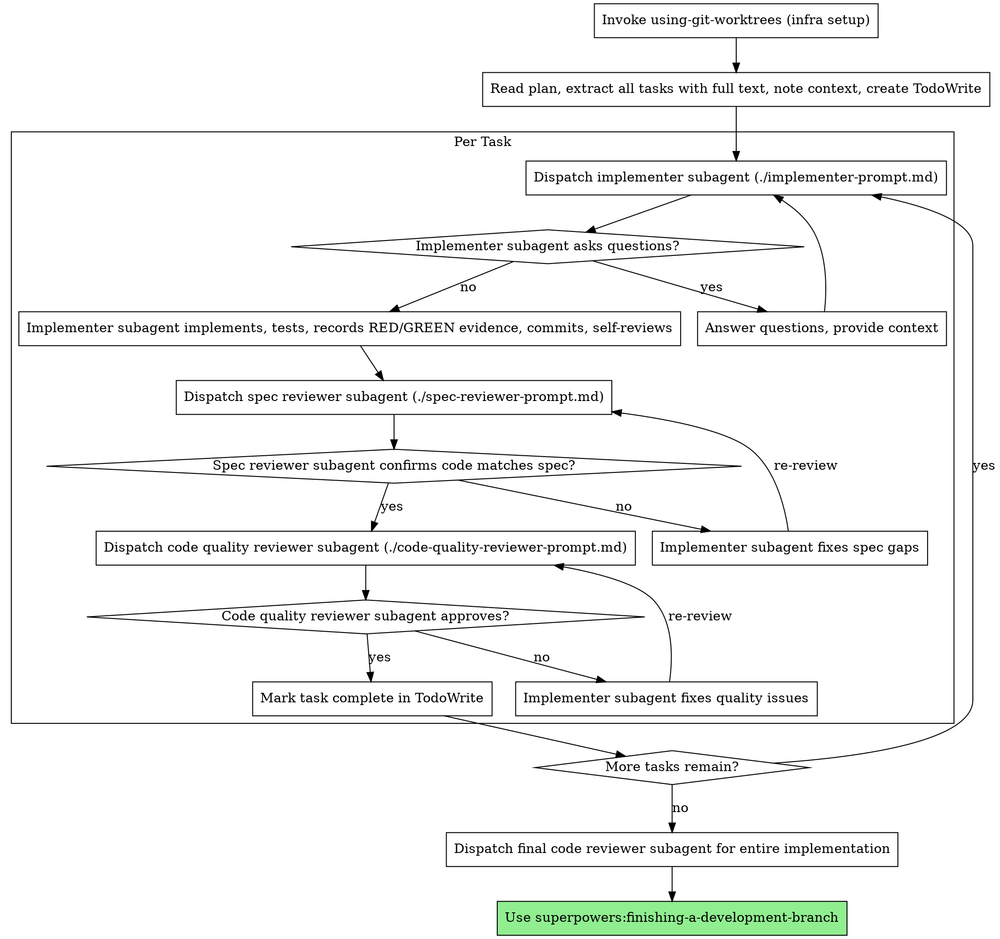

# Subagent-Driven Development

Execute plan by dispatching fresh subagent per task, with two-stage review after each: spec compliance review first, then code quality review.

**Why subagents:** You delegate tasks to specialized agents with isolated context. By precisely crafting their instructions and context, you ensure they stay focused and succeed at their task. They should never inherit your session's context or history — you construct exactly what they need. This also preserves your own context for coordination work.

**Core principle:** Fresh subagent per task + two-stage review (spec then quality) = high quality, fast iteration

## When to Use



**vs. Executing Plans (parallel session):**
- Same session (no context switch)
- Fresh subagent per task (no context pollution)
- Two-stage review after each task: spec compliance first, then code quality
- Faster iteration (no human-in-loop between tasks)

## The Process



Stage note: this skill is Stage 5 (Subagent Development). It MUST invoke `using-git-worktrees` at startup as infrastructure setup.

## PR Loop Execution Mode (Mandatory)

Execute tasks by active PR loop (`PR1..PRn`), not a single version-wide straight run:

1. Select active PR from plan grouping (`Vx.y.z-PR1` first)
2. Execute tasks mapped to that PR with normal implementer + reviewer loops
3. When running the three environment acceptances, execute `autotest -> mocktest -> devicetest` in order and write status only to `Vx.y.z-test.md` under **`## Acceptance status (hooks)`** (not the PR tdd-log). If a run fails, debug and repeat until the version file reflects pass/fail in order.
4. Advance to the next PR (`PR2`, ..., `PRn`) after review/checkpoints for the current PR, switching active PR context for PR-scoped files.
5. After `PRn`, trigger version-level regression/aggregation before final branch completion while keeping active PR context on `PRn` where PR paths are needed.

## Model Selection

Use the least powerful model that can handle each role to conserve cost and increase speed.

**Mechanical implementation tasks** (isolated functions, clear specs, 1-2 files): use a fast, cheap model. Most implementation tasks are mechanical when the plan is well-specified.

**Integration and judgment tasks** (multi-file coordination, pattern matching, debugging): use a standard model.

**Architecture, design, and review tasks**: use the most capable available model.

**Task complexity signals:**
- Touches 1-2 files with a complete spec → cheap model
- Touches multiple files with integration concerns → standard model
- Requires design judgment or broad codebase understanding → most capable model

## Handling Implementer Status

Implementer subagents report one of four statuses. Handle each appropriately:

**DONE:** Proceed to spec compliance review.

**DONE_WITH_CONCERNS:** The implementer completed the work but flagged doubts. Read the concerns before proceeding. If the concerns are about correctness or scope, address them before review. If they're observations (e.g., "this file is getting large"), note them and proceed to review.

**NEEDS_CONTEXT:** The implementer needs information that wasn't provided. Provide the missing context and re-dispatch.

**BLOCKED:** The implementer cannot complete the task. Assess the blocker:
1. If it's a context problem, provide more context and re-dispatch with the same model
2. If the task requires more reasoning, re-dispatch with a more capable model
3. If the task is too large, break it into smaller pieces
4. If the plan itself is wrong, escalate to the human

**Never** ignore an escalation or force the same model to retry without changes. If the implementer said it's stuck, something needs to change.

## Timeout and Degradation Policy (Mandatory)

Subagent orchestration must fail-safe instead of waiting indefinitely.

When an implementer/reviewer subagent stalls or times out:

1. **First timeout:** retry once with tighter scope and explicit success criteria.
2. **Second timeout:** either split task further or switch to a more suitable model.
3. **Third timeout / repeated stall:** controller agent takes over directly (main-agent execution), and logs:
   - timeout symptom
   - retry history
   - why takeover is safer than continued dispatch
4. **Do not loop waiting** without a state change (new prompt scope/model/task split).

Record degradation decisions in PR artifacts (at minimum `Vx.y.z-PRn-subagent-summary.md`) so review can audit why orchestration changed.

## Evidence Gate Per Task

Before marking a task complete, require all of the following:

1. RED evidence: command + failing signal
2. GREEN evidence: command + pass signal
3. If code changed after GREEN, rerun verification and record latest result
4. Completion statement formatted through `verification-before-completion` expectations

If any evidence is missing, keep the task open.

## PR Doc Pack Gate (Mandatory)

For each active PR (`docs/Vx.y.z-<topic>/Vx.y.z-PRn/`), keep these files updated during execution:

- `Vx.y.z-PRn-tdd-log.md`
- `Vx.y.z-PRn-subagent-summary.md`
- `Vx.y.z-PRn-review-report.md`
- `Vx.y.z-PRn-finalize-log.md`

Before dispatching the first implementer subagent for a PR, verify that the full four-file PR doc pack already exists. If any artifact is missing, scaffold it immediately with a minimal heading + status placeholder, then proceed. Do not wait until final handoff to create `subagent-summary`, `review-report`, or `finalize-log`.

Migration rule: if legacy `Vx.y.z-PRn-code-review.md` exists and `Vx.y.z-PRn-review-report.md` does not, rename the legacy file to `Vx.y.z-PRn-review-report.md` and continue with the unified artifact name.

Ownership rule: `Vx.y.z-PRn-review-report.md` must contain reviewer conclusions (spec reviewer, code-quality reviewer, or code-reviewer). Implementer self-review belongs in `Vx.y.z-PRn-subagent-summary.md` and cannot be used as review approval evidence.

Before final handoff, require:

- `Vx.y.z-PRn-finalize-log.md`
- `Vx.y.z-test.md` (version-level test summary)

No task/phase is considered complete if PR doc pack is missing or stale.

Across PR loops, `Vx.y.z-test.md` must be maintained continuously (not appended only at the last minute) — case matrices, EI, blind spots, etc. **Hook-visible** `autotest` / `mocktest` / `devicetest` **status lines** live only under **`## Acceptance status (hooks)`**; update that block when you execute the three (often when closing the version or as each layer completes, per your plan).

## Prompt Templates

- `./implementer-prompt.md` - Dispatch implementer subagent
- `./spec-reviewer-prompt.md` - Dispatch spec compliance reviewer subagent
- `./code-quality-reviewer-prompt.md` - Dispatch code quality reviewer subagent

## Example Workflow

```
You: I'm using Subagent-Driven Development to execute this plan.

[Read plan file once: docs/Vx.y.z-<topic>/Vx.y.z-plan.md]
[Extract all 5 tasks with full text and context]
[Create TodoWrite with all tasks]

Task 1: Hook installation script

[Get Task 1 text and context (already extracted)]
[Dispatch implementation subagent with full task text + context]

Implementer: "Before I begin - should the hook be installed at user or system level?"

You: "User level (~/.config/superpowers/hooks/)"

Implementer: "Got it. Implementing now..."
[Later] Implementer:
  - Implemented install-hook command
  - Added tests, 5/5 passing
  - Self-review: Found I missed --force flag, added it
  - Committed

[Dispatch spec compliance reviewer]
Spec reviewer: ✅ Spec compliant - all requirements met, nothing extra

[Get git SHAs, dispatch code quality reviewer]
Code reviewer: Strengths: Good test coverage, clean. Issues: None. Approved.

[Mark Task 1 complete]

Task 2: Recovery modes

[Get Task 2 text and context (already extracted)]
[Dispatch implementation subagent with full task text + context]

Implementer: [No questions, proceeds]
Implementer:
  - Added verify/repair modes
  - 8/8 tests passing
  - Self-review: All good
  - Committed

[Dispatch spec compliance reviewer]
Spec reviewer: ❌ Issues:
  - Missing: Progress reporting (spec says "report every 100 items")
  - Extra: Added --json flag (not requested)

[Implementer fixes issues]
Implementer: Removed --json flag, added progress reporting

[Spec reviewer reviews again]
Spec reviewer: ✅ Spec compliant now

[Dispatch code quality reviewer]
Code reviewer: Strengths: Solid. Issues (Important): Magic number (100)

[Implementer fixes]
Implementer: Extracted PROGRESS_INTERVAL constant

[Code reviewer reviews again]
Code reviewer: ✅ Approved

[Mark Task 2 complete]

...

[After all tasks]
[Dispatch final code-reviewer]
Final reviewer: All requirements met, ready to merge

Done!
```

## Advantages

**vs. Manual execution:**
- Subagents follow TDD naturally
- Fresh context per task (no confusion)
- Parallel-safe (subagents don't interfere)
- Subagent can ask questions (before AND during work)

**vs. Executing Plans:**
- Same session (no handoff)
- Continuous progress (no waiting)
- Review checkpoints automatic

**Efficiency gains:**
- No file reading overhead (controller provides full text)
- Controller curates exactly what context is needed
- Subagent gets complete information upfront
- Questions surfaced before work begins (not after)

**Quality gates:**
- Self-review catches issues before handoff
- Two-stage review: spec compliance, then code quality
- Review loops ensure fixes actually work
- Spec compliance prevents over/under-building
- Code quality ensures implementation is well-built

**Cost:**
- More subagent invocations (implementer + 2 reviewers per task)
- Controller does more prep work (extracting all tasks upfront)
- Review loops add iterations
- But catches issues early (cheaper than debugging later)

## Red Flags

**Never:**
- Start implementation on main/master branch without explicit user consent
- Skip reviews (spec compliance OR code quality)
- Proceed with unfixed issues
- Dispatch multiple implementation subagents in parallel (conflicts)
- Make subagent read plan file (provide full text instead)
- Skip scene-setting context (subagent needs to understand where task fits)
- Ignore subagent questions (answer before letting them proceed)
- Accept "close enough" on spec compliance (spec reviewer found issues = not done)
- Skip review loops (reviewer found issues = implementer fixes = review again)
- Let implementer self-review replace actual review (both are needed)
- **Start code quality review before spec compliance is ✅** (wrong order)
- Move to next task while either review has open issues
- Accept completion without fresh command evidence
- Let TDD evidence stay implicit ("tests pass") without command/output trace
- Finish work without updating PR doc pack files
- Declare completion without `*-finalize-log.md`

**If subagent asks questions:**
- Answer clearly and completely
- Provide additional context if needed
- Don't rush them into implementation

**If reviewer finds issues:**
- Implementer (same subagent) fixes them
- Reviewer reviews again
- Repeat until approved
- Don't skip the re-review

**If subagent fails task:**
- Dispatch fix subagent with specific instructions
- Don't try to fix manually (context pollution)

## Integration

**Required workflow skills:**
- **superpowers:using-git-worktrees** - REQUIRED: Set up isolated workspace before starting
- **superpowers:writing-plans** - Creates the plan this skill executes
- **superpowers:requesting-code-review** - Review-stage template used by reviewer subagents in this skill's loops
- **superpowers:verification-before-completion** - REQUIRED before task completion claims
- **superpowers:finishing-a-development-branch** - Complete development after all tasks

**Subagents should use:**
- **superpowers:test-driven-development** - Subagents follow TDD for each task

**Alternative workflow:**
- **superpowers:executing-plans** - Use for parallel session instead of same-session execution
